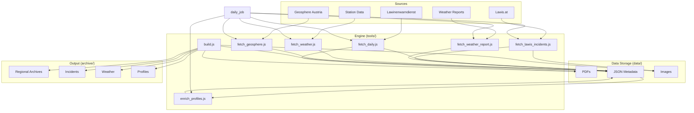

# Project Context & Architecture

> **Master Entry Point for AI Agents**
> *Read this file first to understand the system map.*

## System Overview
The **Avalanche Archiver** is a Node.js-based system that:
1.  **Scrapes** daily avalanche bulletins, weather reports, and incidents from public sources (Bayern, Tirol, Vorarlberg).
2.  **Archives** these assets (PDFs, JSON, Images) permanently.
3.  **Builds** a static HTML website to browse this historical data.

## System Map (Mermaid)

## Documentation Index

### 📂 Archive Output (`archive/`)
*The user-facing website.*
- [Root Context](file:///c:/Users/User/Documents/GitHub/avalanche-archiver_v1-1/archive/CONTEXT.md)
- **Regions**:
    - [Allgäu Alps Central](file:///c:/Users/User/Documents/GitHub/avalanche-archiver_v1-1/archive/allgau-alps-central/CONTEXT.md)
    - [Allgäu Alps East](file:///c:/Users/User/Documents/GitHub/avalanche-archiver_v1-1/archive/allgau-alps-east/CONTEXT.md)
    - [Allgäu Alps West](file:///c:/Users/User/Documents/GitHub/avalanche-archiver_v1-1/archive/allgau-alps-west/CONTEXT.md)
    - [Allgäu Prealps](file:///c:/Users/User/Documents/GitHub/avalanche-archiver_v1-1/archive/allgau-prealps/CONTEXT.md)
- **Features**:
    - [Incidents](file:///c:/Users/User/Documents/GitHub/avalanche-archiver_v1-1/archive/incidents/CONTEXT.md) - Accident reports & analysis.
    - [Weather](file:///c:/Users/User/Documents/GitHub/avalanche-archiver_v1-1/archive/weather/CONTEXT.md) - Mountain station data.
    - [Profiles](file:///c:/Users/User/Documents/GitHub/avalanche-archiver_v1-1/archive/profiles/CONTEXT.md) - Snowpack analysis.
    - [Snow Depth](file:///c:/Users/User/Documents/GitHub/avalanche-archiver_v1-1/archive/snow-depth/CONTEXT.md) - 3D Map.
    - [Ground & Webcams](file:///c:/Users/User/Documents/GitHub/avalanche-archiver_v1-1/archive/ground-conditions/CONTEXT.md) - User uploads.

### 🗺️ Planning & Tools
*Interactive Modules.*
- [Planning Context](file:///c:/Users/User/Documents/GitHub/avalanche-archiver_v1-1/planning/CONTEXT.md)
- [GPX Library Context](file:///c:/Users/User/Documents/GitHub/avalanche-archiver_v1-1/gpx-library/CONTEXT.md) - Route Archive & Analysis.

### 🛠️ Tools & Logic (`tools/`)
*The scraping and build logic.*
- [Tools Context](file:///c:/Users/User/Documents/GitHub/avalanche-archiver_v1-1/tools/CONTEXT.md)
- **Config**: `tools/lib/config.js` (Central registry for all URLs and paths).
- **UI Source Files**:
    - **Shared Templates**: `tools/lib/templates.js` (Generates incidents, weather, profiles).
    - **Single Page Apps**:
        - [Snow Depth App](file:///c:/Users/User/Documents/GitHub/avalanche-archiver_v1-1/snow-depth/index.html)
        - [Planning App](file:///c:/Users/User/Documents/GitHub/avalanche-archiver_v1-1/planning/index.html)

## Key Workflows
1.  **Daily Fetch**: `npm run fetch:all` (Orchestrates `fetch:daily`, `fetch:weather`, `fetch:report`, `fetch:geosphere`, `fetch:incidents`, `enrich:profiles`).
2.  **Build Site**: `npm run build` (Generates `archive/` from `data/`).
3.  **Serve**: `npm run serve` (Local preview).

## 🧠 AI Resources
*Helper files specifically for AI agents.*
- **[Data Models](file:///c:/Users/User/Documents/GitHub/avalanche-archiver_v1-1/.ai/DATA_MODELS.md)**: Type definitions for `weather_stations.json`, `incidents.json`, etc.
- **Workflows**:
    - [Add New Region](file:///c:/Users/User/Documents/GitHub/avalanche-archiver_v1-1/.agent/workflows/add_region.md)
    - [Debug Scraper](file:///c:/Users/User/Documents/GitHub/avalanche-archiver_v1-1/.agent/workflows/debug_scraper.md)

